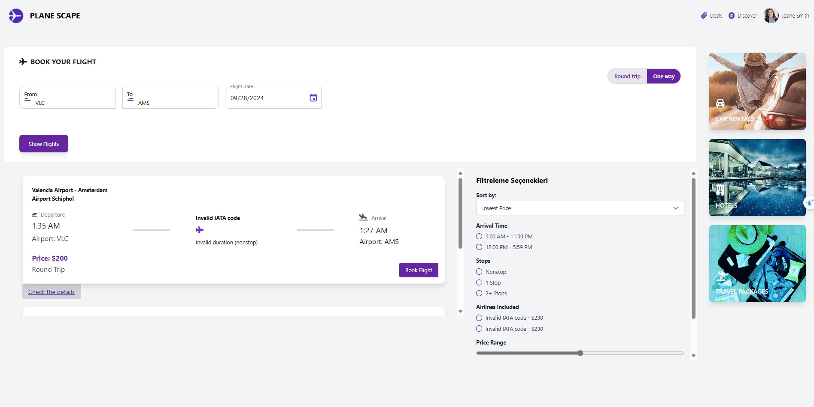
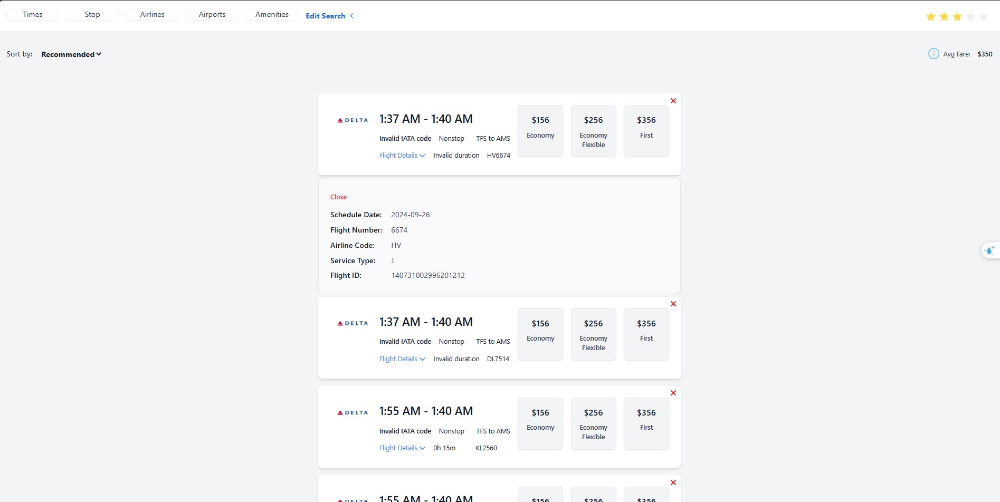

# Flight Reservation Application


> A web application to search, filter, and book flights based on user input, including round-trip and one-way flights.

## HOME PAGE

<p align="center">
  
</p>

## FLIGHT SEARCH PAGE

<p align="center">
  
</p>

## SEARCH RESULTS PAGE

<p align="center">
  
</p>


## Table of Contents

- [Overview](#overview)
- [Features](#features)
- [Technologies Used](#technologies-used)
- [Prerequisites](#prerequisites)
- [Getting Started](#getting-started)
- [Usage](#usage)
- [Client Folder Structure](#client-folder-structure)
- [Server Folder Structure](#server-folder-structure)

## Overview

The Flight Search Application is a user-friendly platform that allows users to search for flights between destinations. Users can choose between one-way or round-trip options and select flight dates. The application provides real-time data to show flight availability and details based on the search criteria.

## Features

- **Search Flights**: Users can search for available flights by selecting departure and arrival locations, flight date, and optional return date for round trips.
- **Flight Filters**: Filters allow for narrowing down flight options based on arrival and departure preferences.
- **Flight Booking**: Users can initiate the booking process from the results page.
- **Loading Animation**: Displays a loading animation while fetching flight data to improve user experience.

## Technologies Used

- **Frontend**: React, TailwindCSS, Ant Design (antd), FontAwesome
- **Date Management**: Day.js, MUI DatePicker
- **Backend**: Node.js, Express
- **API Handling**: Axios
- **Database**: (Optional: MongoDB for booking information)
- **Icons**: FontAwesome for visual enhancements

## Prerequisites

- [Node.js and npm](https://nodejs.org/): Ensure you have Node.js and npm installed.
- Backend service to provide flight data (REST API, in this case, it's expected to run at `http://localhost:5001`).

## Getting Started

1. **Clone the repository:**
   ```sh
   git clone <repository-url>

2. **Navigate to the project directory:**
   ```sh
   cd flight-reservation-app
3. **Install backend dependencies:**
   ```sh
   cd server
   npm install
4. **Install frontend dependencies:**
   ```sh
   cd client
   npm install
5. **Create a .env file in the backend directory with the following environment variables:**
   ```sh
    PORT=5001
    BASE_URL=http://localhost:8000
    MONGODB_URI=<your-mongodb-connection-url>
    SCHIPHOL_API_KEY=<your-api-key>
    SCHIPHOL_APP_ID=<your-api-id>
6. **Start the server:**
   ```sh
   nodemon
7. **Start the client:**
   ```sh
   npm start

## Usage

- **Search Flights:** Users can search for available flights by entering departure and arrival airport codes, and flight dates, and optionally for round-trip flights.
- **Filter Results:** Users can filter flight results based on arrival and departure preferences.
- **Book Flights:** After selecting a flight, users can proceed to book directly from the search results page.
- **Loading Animation:** A loading animation is displayed while fetching flight data to improve user experience.

## Client Folder Structure

- client
  - public
  - src
  - .gitignore
  - package.json
  - README.md

## Server Folder Structure

- server
  - models
  - routes
  - .env
  - .gitignore
  - server.js
  - package.json
  - README.md


